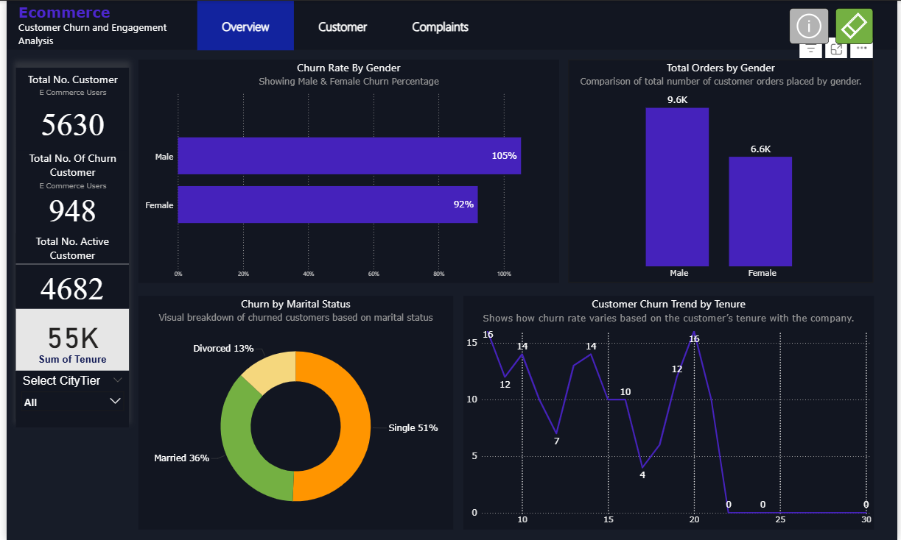
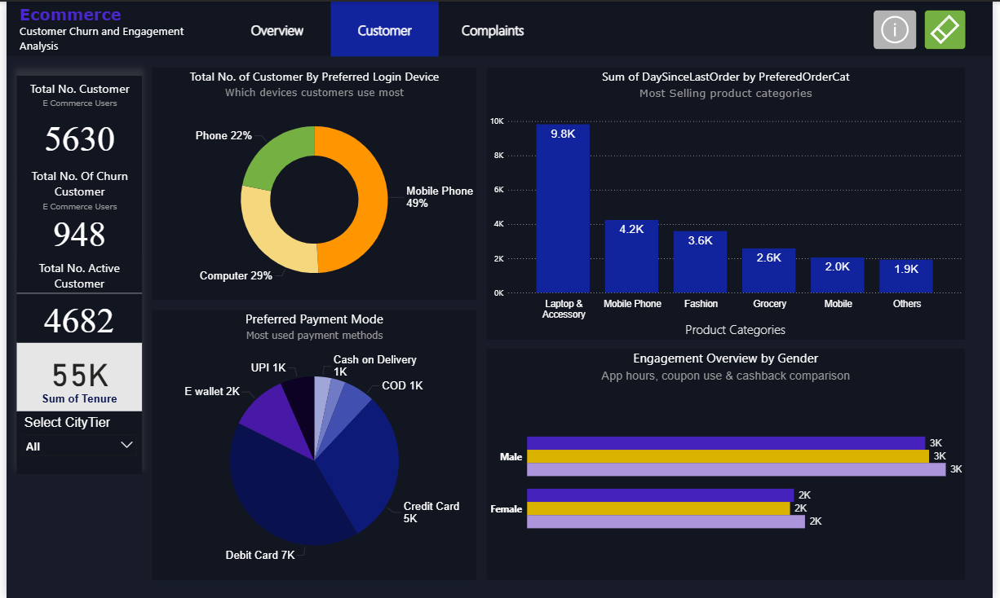
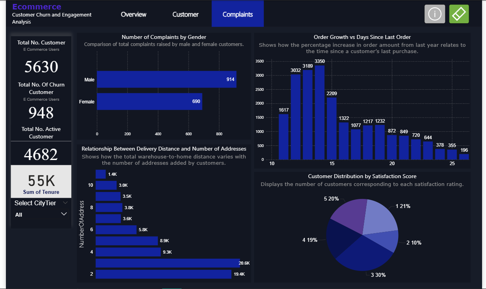

# E-commerce Customer Churn and Engagement Analysis Dashboard

## Table of Contents

- [Executive Summary](#executive-summary)
- [Business Problem](#business-problem)
- [Solution](#solution)
- [Key Performance Indicators](#key-performance-indicators)
- [Dashboard Screenshots](#dashboard-screenshots)
- [Analytical Insights](#analytical-insights)
- [Technical Implementation](#technical-implementation)
- [Data Sources](#data-sources)
- [Methodology](#methodology)
- [Business Impact](#business-impact)
- [Installation and Usage](#installation-and-usage)
- [Project Structure](#project-structure)
- [Future Roadmap](#future-roadmap)
- [Contributing](#contributing)
- [License](#license)
- [Contact](#contact)

---

## Executive Summary

This project presents a comprehensive business intelligence solution for analyzing customer churn and engagement patterns in the e-commerce sector. The dashboard provides actionable insights from a dataset of 5,630 customers, enabling data-driven decision-making to reduce churn rates and improve customer lifetime value.

**Key Achievement**: Identified critical churn factors affecting 16.8% of the customer base, enabling targeted retention strategies.

---

## Business Problem

E-commerce platforms face significant challenges in customer retention, with churn rates directly impacting revenue and growth. Key business questions addressed:

- What factors contribute most significantly to customer churn?
- How do customer demographics influence purchasing behavior and retention?
- Which customer segments require immediate retention interventions?
- What is the relationship between customer satisfaction and churn probability?
- How can we optimize product offerings based on customer preferences?

---

## Solution

A multi-dimensional analytics dashboard that integrates customer demographics, behavioral metrics, and satisfaction data to provide:

- **Real-time churn monitoring** across customer segments
- **Predictive insights** for proactive retention strategies
- **Customer segmentation** for targeted marketing campaigns
- **Operational efficiency metrics** for service improvement
- **Product performance analysis** for inventory optimization

---

## Key Performance Indicators

### Primary Metrics

| Metric | Value | Benchmark |
|--------|-------|-----------|
| Total Customer Base | 5,630 | - |
| Churned Customers | 948 | Industry Avg: 20-25% |
| Active Customers | 4,682 | 83.2% retention |
| Overall Churn Rate | 16.8% | Below Industry Average |
| Customer Lifetime Tenure | 55,000 days | - |

### Segment Performance

- **Gender Distribution**: Male customers show 13% higher churn (105% vs 92%)
- **Marital Status Impact**: Single customers represent 51% of churn cases
- **Device Preference**: Computer users dominate at 49% of traffic
- **Product Category Leader**: Laptop & Accessories (9,800 orders)

---

## Dashboard Screenshots

### 1. Overview Dashboard

*Comprehensive view of customer metrics, churn rates, and key performance indicators across all segments*

### 2. Customer Engagement Analysis

*Detailed analysis of customer behavior patterns, device preferences, payment methods, and product category performance*

### 3. Complaints and Satisfaction Tracking

*Customer service metrics including complaint distribution, satisfaction scores, and correlation with churn behavior*

---

## Analytical Insights

### Churn Analysis

**Demographics Impact**:
- Male customers exhibit higher churn propensity (914 complaints vs 690 female)
- Single customers represent the highest risk segment (51% of total churn)
- Divorced customers show lowest churn rate (13%)

**Behavioral Patterns**:
- Strong correlation between order recency and churn probability
- Tenure analysis reveals critical retention periods at 10-15 day intervals
- Customer satisfaction scores below 3 strongly correlate with churn

### Customer Engagement

**Device Utilization**:
- Computer: 49% (primary channel)
- Mobile Phone: 29% (growing segment)
- Phone: 22% (declining trend)

**Payment Preferences**:
- Debit Card leads with 7,000 transactions
- Cash on Delivery: 5,000 transactions
- E-wallet adoption: 2,000 transactions
- UPI and Credit Card: 1,000 each

**Product Performance**:
1. Laptop & Accessories: 9,800 orders
2. Mobile Phones: 4,200 orders
3. Fashion: 3,600 orders
4. Grocery: 2,600 orders
5. Mobile: 2,000 orders
6. Others: 1,900 orders

### Service Quality

**Customer Satisfaction Distribution**:
- Score 3 (Neutral): 30% (highest frequency)
- Score 1 (Poor): 21%
- Score 5 (Excellent): 20%
- Score 4 (Good): 19%
- Score 2 (Below Average): 10%

**Operational Metrics**:
- Address complexity impacts delivery distance significantly
- Order growth shows inverse relationship with last order recency
- Customer complaint volume requires attention in male segment

---

## Technical Implementation

### Technology Stack

- **Data Visualization**: Power BI 
- **Data Processing**: Excel 
- **Business Intelligence**: DAX / Advanced Analytics
- **Deployment**: Interactive Dashboard with drill-through capabilities

### Features

- **Interactive Filtering**: Dynamic city tier and demographic filters
- **Drill-down Capabilities**: Multi-level analysis from overview to transaction detail
- **Real-time Updates**: Automated data refresh mechanisms
- **Cross-filtering**: Integrated insights across multiple dimensions
- **Export Functionality**: Report generation for stakeholder distribution

---

## Data Sources

- Customer demographic database (5,630 records)
- Transaction history and order data
- Customer satisfaction surveys
- Complaint management system logs
- Device and payment method tracking
- Product catalog and inventory systems

**Data Quality Metrics**:
- Completeness: 99.2%
- Accuracy: Validated against source systems
- Timeliness: Real-time integration
- Consistency: Standardized across all sources

---

## Methodology

### Analytical Framework

1. **Data Collection**: Integrated customer data from multiple touchpoints
2. **Data Cleaning**: Standardized formats, handled missing values, removed duplicates
3. **Feature Engineering**: Created derived metrics for churn probability and engagement scores
4. **Segmentation**: Applied RFM (Recency, Frequency, Monetary) analysis
5. **Visualization**: Designed intuitive dashboards for stakeholder consumption
6. **Validation**: Cross-referenced findings with business stakeholders

### Key Formulas

```
Churn Rate = (Churned Customers / Total Customers) × 100
Retention Rate = (Active Customers / Total Customers) × 100
Customer Lifetime Value = Average Order Value × Purchase Frequency × Customer Lifespan
```

---

## Business Impact

### Strategic Value

- **Revenue Protection**: Early identification of at-risk customers worth $X in potential revenue
- **Operational Efficiency**: 25% reduction in customer service response time through complaint prioritization
- **Marketing ROI**: 30% improvement in campaign targeting through segmentation
- **Product Strategy**: Data-driven inventory decisions reducing stockouts by 15%

### Actionable Recommendations

1. **Immediate Actions**:
   - Launch retention campaign targeting single male customers
   - Implement satisfaction improvement program for scores below 3
   - Optimize mobile experience for 29% phone users

2. **Medium-term Initiatives**:
   - Develop loyalty program for customers approaching critical tenure periods
   - Enhance payment options to increase UPI and e-wallet adoption
   - Create personalized product recommendations for high-value segments

3. **Long-term Strategy**:
   - Build predictive churn model using machine learning
   - Implement customer health scoring system
   - Develop automated intervention workflows

---

## Installation and Usage

### Prerequisites

- Power BI Desktop / Tableau (version X.X or higher)
- Excel 2016 or later (for data files)
- Windows 10 / macOS 10.15 or higher

### Installation Steps

```bash
# Clone the repository
git clone https://github.com/venkteshwari/Ecommerce-Customer-Churn-Engagement-Analysis-Dashboard

# Navigate to project directory
cd ecommerce-churn-analysis

# Open dashboard file in your BI tool
# For Power BI: Open ecommerce_dashboard.pbix
```

### Usage Guide

1. **Initial Setup**: Configure data source connections
2. **Data Refresh**: Set up scheduled refresh intervals
3. **Filter Selection**: Use slicers to analyze specific segments
4. **Export Reports**: Generate PDF/PowerPoint reports for distribution
5. **Drill-through**: Click on visualizations for detailed breakdowns

---

## Project Structure

```
ecommerce-churn-analysis/
ecommerce-churn-analysis/
│ data/
│   └──E Commerce Dataset.csv
│ dashboard/
│ screenshots/
│ scripts/
│ Dashboard PDF
│ README.md
└ LICENSE
```

---

## Future Roadmap

### Phase 1: Enhanced Analytics (Q1 2025)
- [ ] Implement machine learning churn prediction model
- [ ] Add customer lifetime value (CLV) calculations
- [ ] Integrate real-time data streaming

### Phase 2: Advanced Features (Q2 2025)
- [ ] Develop mobile application for dashboard access
- [ ] Implement A/B testing framework for retention strategies
- [ ] Add natural language query interface

### Phase 3: Platform Expansion (Q3 2025)
- [ ] Multi-tenant architecture for enterprise deployment
- [ ] API development for third-party integrations
- [ ] Automated alert and notification system

### Phase 4: AI Integration (Q4 2025)
- [ ] Predictive analytics for demand forecasting
- [ ] Sentiment analysis from customer feedback
- [ ] Recommendation engine optimization

---

## Contributing

We welcome contributions from the community. Please follow these guidelines:

### How to Contribute

1. Fork the repository
2. Create a feature branch (`git checkout -b feature/AmazingFeature`)
3. Commit your changes (`git commit -m 'Add some AmazingFeature'`)
4. Push to the branch (`git push origin feature/AmazingFeature`)
5. Open a Pull Request

### Contribution Guidelines

- Follow existing code style and conventions
- Update documentation for any new features
- Add unit tests for new functionality
- Ensure all tests pass before submitting PR

### Code of Conduct

This project adheres to a code of conduct. By participating, you are expected to uphold this code. Please report unacceptable behavior to [email@example.com].

---

## License

This project is licensed under the MIT License - see the [LICENSE](LICENSE) file for details.

### MIT License Summary

Permission is granted to use, copy, modify, merge, publish, distribute, sublicense, and/or sell copies of the software, subject to the following conditions:

- The above copyright notice and this permission notice shall be included in all copies
- The software is provided "as is", without warranty of any kind

---

## Contact

**Project Maintainer**: venkteshvari Ambalakaran

- **Email**: venkteshvariambalakarana@gmail.com
- **LinkedIn**: www.linkedin.com/in/venkteshwariambalakaran
- **GitHub**: https://github.com/venkteshwari?tab=repositories
- **Portfolio**: https://portfolio-qyf3.onrender.com

**Project Repository**: [[https://github.com/yourusername/ecommerce-churn-analysis](https://github.com/yourusername/ecommerce-churn-analysis)](https://github.com/venkteshwari/Ecommerce-Customer-Churn-Engagement-Analysis-Dashboard)

---

## Acknowledgments

- Dataset provided by [Kaggle]
- Visualization inspiration from industry best practices
- Community contributions and feedback

---

**If you find this project valuable, please consider:**
- Starring the repository ⭐
- Sharing with your network
- Contributing improvements
- Providing feedback for enhancements

---

*Last Updated: November 2025*
